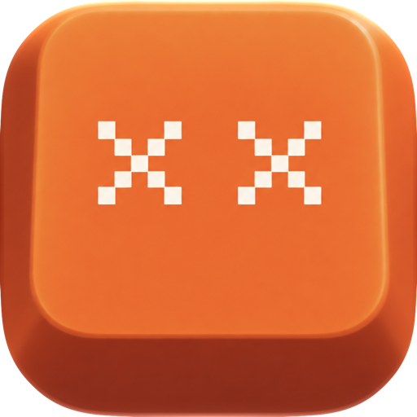

<p align="center">
  
</p>

<h1 align="center">Dokke</h1>

<p align="center">
  <b>App dock that syncs from your Mac to any device on your local network.</b><br>
  Born from an old Galaxy J5 sitting at home — today runs on any Android, iPhone, or browser.
</p>

<p align="center">
  <a href="README.md">Português</a> | <b>English</b>
</p>

<p align="center">
  
  
  
  
  
  
  
  <a href="#support"></a>
</p>

App dock manager — control and launch your pinned Mac apps from any device.

The idea came from an old Galaxy J5 lying unused at home. The goal was to give it a purpose, and Dokke was created: a dock system that synchronizes apps between a Mac and any browser-enabled device (Android, iPhone, tablet, or another computer).

## Installation

For a guided setup without terminal commands, visit the [installation page](https://dokke.vercel.app/).

### Mac — Host App

[Download Dokke for macOS](https://github.com/felipenalves/Dokke/releases/latest/download/Dokke-macOS.dmg) → open the `.dmg` → drag Dokke into Applications → launch the app.

The Mac serves as the host: it runs the embedded server and provides the dock to other devices on the same local network.

> **If macOS blocks the first launch:** Open **System Settings → Privacy & Security → Security → Open Anyway → Open**. This confirmation is standard for apps distributed outside the App Store.

### Android

[Download the APK](https://github.com/felipenalves/Dokke/releases/latest/download/dokke.apk) and install it. Open Dokke on your Mac, find the connection address and 4-digit PIN in the **About** tab, and enter it on your phone.

### iPhone

iPhone uses the web PWA through Safari. Open the URL shown in the **About** tab in Safari, then tap **Add to Home Screen**.

> Windows host support is currently in development.

## How it Works

```
┌─────────────┐      WebSocket       ┌─────────────┐
│  Mac (Dokke) │ ◄──────────────────► │ Android/Phone│
│  SwiftUI app │      HTTP API       │   PWA/APK    │
└──────┬──────┘                      └──────────────┘
       │
       ▼
  Node.js server (port 3000)
  - serves the PWA (index.html)
  - manages config (pinned apps)
  - real-time WebSocket push
  - macOS app icons extraction
  - UDP auto-discovery (port 3001)
```

1. The **Mac app** (Dokke) manages your apps — pin, unpin, and reorder.
2. The **Node.js server** syncs state over WebSocket.
3. The **client device** (Android, iPhone, tablet) receives updates in real time.
4. Tapping a tile on your device activates the app on your Mac.
5. **Zero IP configuration**: devices find the Mac automatically via UDP broadcast (`dokke:discover`, port 3001) — if the IP changes, it rediscovers automatically.

## Tech Stack

| Layer | Technology |
|---|---|
| Mac app | Swift, SwiftUI, MenuBarExtra, Liquid Glass (macOS 26+) |
| Server | Node.js, `ws` (WebSocket), vanilla HTTP (zero dependencies besides `ws`) |
| Web PWA | Vanilla HTML/CSS/JS, CSS Grid, backdrop-filter blur, i18n support |
| Android | Kotlin, WebView wrapper (pre-built APK included) |
| Sync | WebSocket (real-time push) + UDP broadcast (discovery) |

## Development

This section is for compiling and contributing to the project.

### macOS App

```sh
# Clone repository
git clone https://github.com/felipenalves/Dokke.git
cd Dokke

# Compile and install macOS app
cd mac && ./install.sh --open
```

The app starts the background server automatically (the **About** tab displays the network URL). Quitting the app stops the server.

### Terminal Server (Stand-alone)

```sh
npm install
node server.js
# → http://localhost:3000
```

### Automated Tests

```sh
npm test
```

### Android Build

```sh
cd android
./gradlew assembleDebug
# Output APK: app/build/outputs/apk/debug/
```

### iPhone (PWA over HTTPS)

iOS requires HTTPS for standalone home-screen PWAs. Use Cloudflare tunnel for local testing:

```sh
brew install cloudflared
cloudflared tunnel --url http://localhost:3000
# → access via the https://xxx.trycloudflare.com URL
```

## License

MIT © Felipe Natanael
